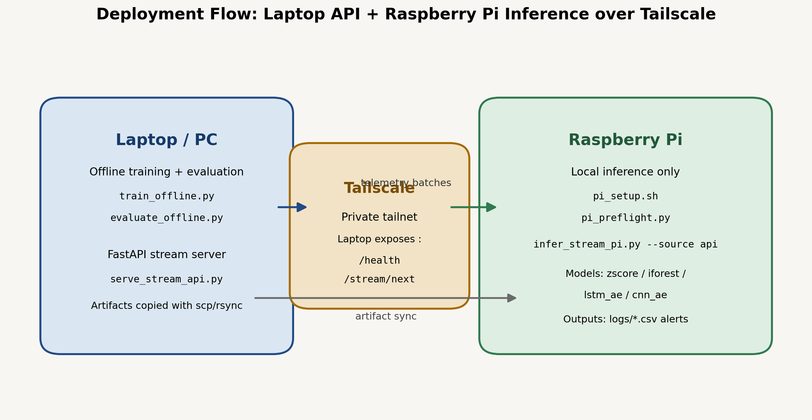
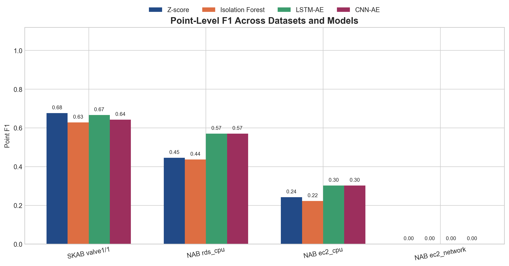
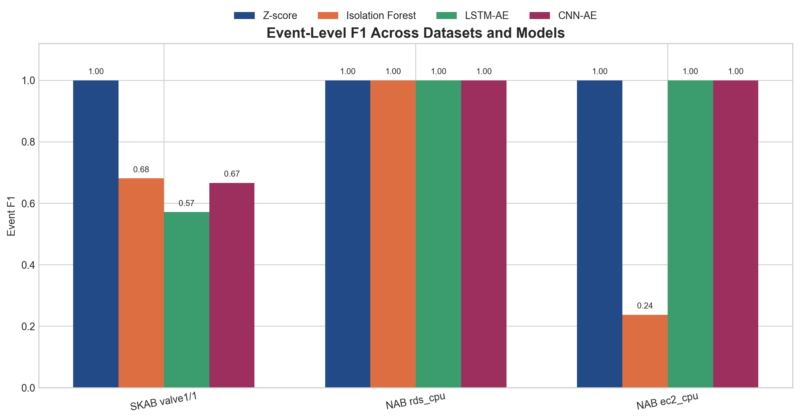
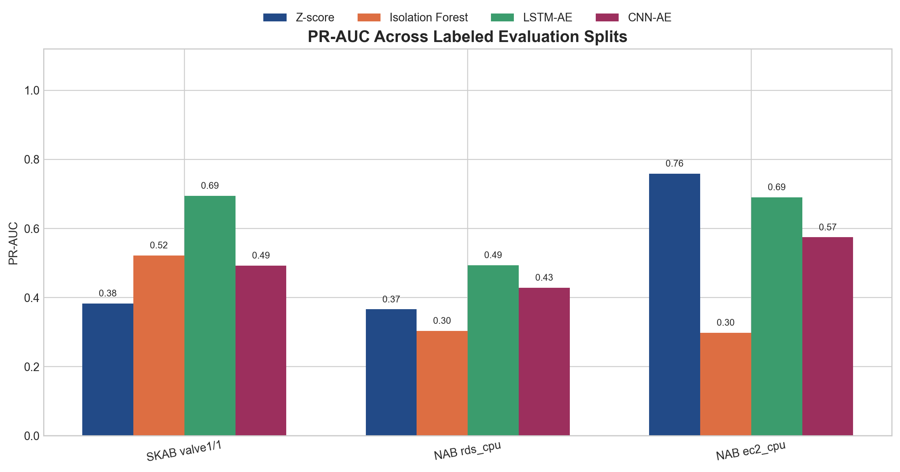
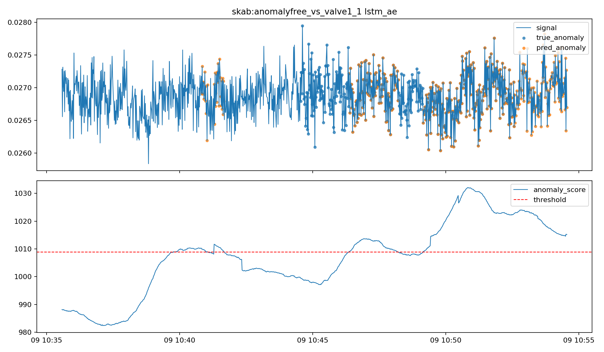
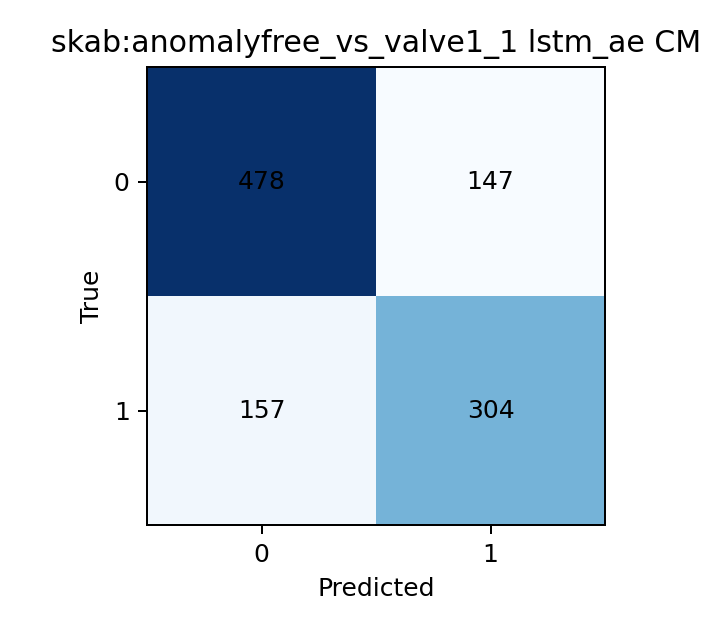
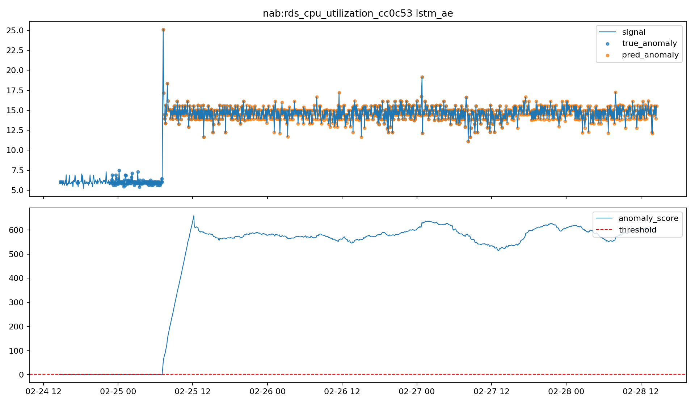
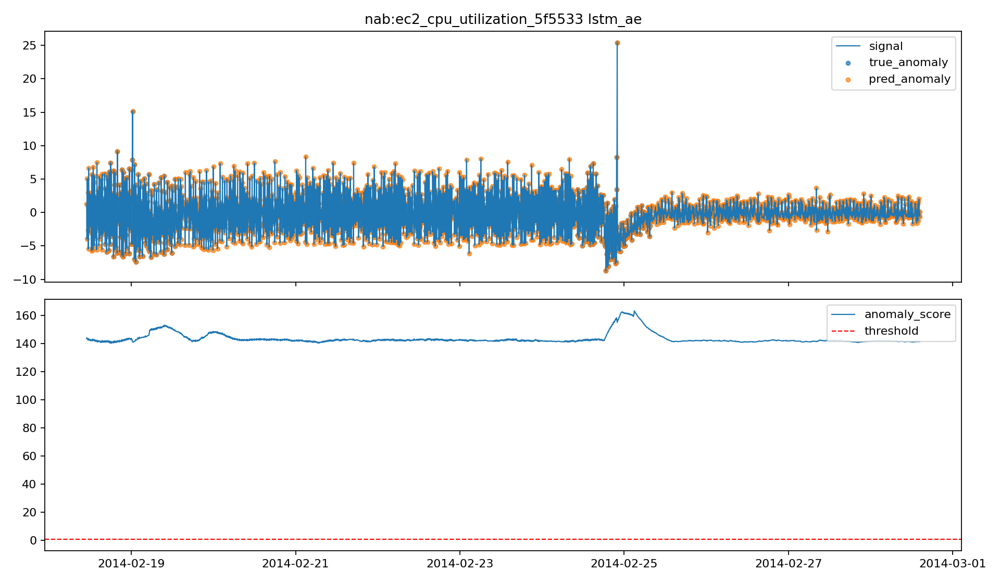

# Final Report: End-to-End Telemetry Anomaly Detection with Laptop-to-Raspberry Pi Streaming

## 1. Project Overview
This project delivers an end-to-end anomaly detection system for telemetry time series. The pipeline trains and evaluates models offline on a laptop, then deploys the trained artifacts to a Raspberry Pi for streaming inference. The implemented model set is `zscore`, `iforest`, `lstm_ae`, and `cnn_ae`, and the datasets are NAB `realAWSCloudwatch` and SKAB.

## 2. Offline Pipeline
The offline stage handles dataset loading, preprocessing, feature engineering, model training, threshold calibration, evaluation, and visualization. The implementation was designed so that the same preprocessing assumptions used offline can be preserved later during streaming inference on the Raspberry Pi.

### 2.1 Data characteristics
The two datasets are useful because they stress the pipeline in different ways.

- **SKAB** is closer to a controlled industrial setting. Training uses the anomaly-free file and testing uses `valve1/1.csv`, so the learning problem is clean: learn normal behaviour first, then detect a fault in a separate operational trace. This makes SKAB a good benchmark for checking whether the models can clearly separate normal and abnormal behaviour.
- **NAB realAWSCloudwatch** is more operationally messy. The AWS series are noisier, more non-stationary, and less uniform than SKAB. Their anomaly windows are defined as labeled intervals rather than isolated spikes, so there is more ambiguity around the exact event boundaries. This is why event-level metrics matter strongly for NAB.

In practical terms, SKAB is the better dataset for demonstrating stable thresholding, while NAB is the better dataset for testing robustness to drift, trend, and noisier real-world telemetry.

### 2.2 Preprocessing and feature engineering
The preprocessing path includes timestamp parsing, missing-value handling, interpolation, rolling detrending, smoothing/standardization where configured, lag embeddings, rolling statistics, FFT features, and optional STL seasonality review.

The base configuration uses a sliding window of `60` points with stride `1`, standardization enabled, lag steps `[1, 5, 10]`, and FFT energy features. These choices were made to give the baseline models access not only to the current point but also to short-term temporal context.

Dataset-specific preprocessing choices matter:

- **SKAB** uses warmup-based threshold calibration during streaming because the normal prefix of the test stream is useful for estimating a deployment threshold.
- **NAB** uses an anomaly-aware split and a rolling detrend window of `144` samples. This is important because the AWS metrics contain slow level shifts that can make simple thresholding unstable if the trend is not removed first.
- **NAB** also uses `drop_labeled_anomalies_from_train: true`, which prevents the training partition from being contaminated by known anomalous windows.

These processing choices directly affect model behaviour. For example, detrending helps prevent slow shifts from being interpreted as anomalies, while lag and FFT features help the simpler baseline models respond to short temporal patterns that would otherwise be invisible in a pure pointwise setup.

### 2.3 Model roles and expected behaviour
The four implemented models serve different roles in the pipeline rather than being interchangeable alternatives.

- **Z-score** is the most interpretable model. It works well when anomalies create a clear deviation in magnitude relative to recent normal behaviour. It is also very sensitive to threshold calibration, which is why it performed especially well on SKAB after warmup calibration.
- **Isolation Forest** is a stronger baseline than plain thresholding because it can combine multiple engineered features nonlinearly. However, it also tends to produce fragmented detections when the score fluctuates around the threshold, which is visible in the large predicted event counts on some splits.
- **LSTM Autoencoder** is designed to capture longer temporal structure. Instead of focusing on a single engineered point, it learns whether an entire sequence can be reconstructed as normal. This makes it well suited to sustained or shape-based anomalies.
- **CNN Autoencoder** also uses reconstruction error, but it is more focused on local temporal motifs and short-range shape deviations. In this project it often tracked the LSTM closely, especially on NAB.

This combination of models was useful because it allowed comparison between simple interpretable baselines and more expressive temporal models without changing the surrounding pipeline.

## 3. Raspberry Pi Implementation
Training is kept on the laptop. The Raspberry Pi is used only for inference. This is the correct deployment split because the Pi should execute a lightweight edge role while the heavier model fitting stays offline.

The implemented setup is:
1. retrain and evaluate on the laptop with `train_offline.py` and `evaluate_offline.py`
2. start the FastAPI stream server on the laptop with `serve_stream_api.py`
3. connect the laptop and Raspberry Pi to the same Tailscale tailnet
4. clone the repository on the Pi and run `pi_setup.sh`
5. run `pi_preflight.py` on the Pi to verify imports, file layout, Tailscale status, and API reachability
6. copy the trained artifact folder to the Pi with `scp` or `rsync`
7. run `infer_stream_pi.py --source api` on the Pi so it pulls data batches from the laptop API and performs local inference

The communication model is straightforward. The laptop hosts FastAPI endpoints `GET /health` and `GET /stream/next`. The Pi reaches the laptop through its Tailscale hostname or IP, for example `http://<laptop-tailnet-name>:8000`. Only telemetry rows are sent over the network; the trained models stay local on the Pi. This means the Pi is the true inference node and the laptop is only the telemetry source.

A representative API-backed inference command on the Pi is:

```bash
python scripts/infer_stream_pi.py --dataset skab --split anomalyfree_vs_valve1_1 --model lstm_ae --source api --api-base-url http://<laptop-tailnet-name>:8000 --api-batch-size 32 --log-file logs/pi_lstm_api.csv
```

To keep online inference consistent with offline training, the streaming path rebuilds baseline feature vectors using the feature-column schema stored in artifact metadata. This avoids feature mismatches between the offline scaler and the online stream.



## 4. Current Results
### 4.1 Point-level F1
| Variant | Z-score | Isolation Forest | LSTM-AE | CNN-AE |
| --- | --- | --- | --- | --- |
| SKAB valve1/1 | 0.677 | 0.628 | 0.667 | 0.642 |
| NAB rds_cpu | 0.446 | 0.437 | 0.571 | 0.571 |
| NAB ec2_cpu | 0.242 | 0.223 | 0.302 | 0.302 |
| NAB ec2_network | 0.000 | 0.000 | 0.000 | 0.000 |

### 4.2 Event-level F1
| Variant | Z-score | Isolation Forest | LSTM-AE | CNN-AE |
| --- | --- | --- | --- | --- |
| SKAB valve1/1 | 1.000 | 0.681 | 0.571 | 0.667 |
| NAB rds_cpu | 1.000 | 1.000 | 1.000 | 1.000 |
| NAB ec2_cpu | 1.000 | 0.237 | 1.000 | 1.000 |
| NAB ec2_network | n/a | n/a | n/a | n/a |

### 4.3 Best-model summary
| Variant | Best point-F1 | F1 | Best PR-AUC | PR-AUC | Best event-F1 | Event F1 |
| --- | --- | --- | --- | --- | --- | --- |
| SKAB valve1/1 | Z-score | 0.677 | LSTM-AE | 0.695 | Z-score | 1.000 |
| NAB rds_cpu | LSTM-AE | 0.571 | LSTM-AE | 0.493 | Z-score, Isolation Forest, LSTM-AE, CNN-AE | 1.000 |
| NAB ec2_cpu | LSTM-AE | 0.302 | Z-score | 0.759 | Z-score, LSTM-AE, CNN-AE | 1.000 |
| NAB ec2_network | Z-score | 0.000 | n/a | n/a | n/a | n/a |

## 5. Discussion of Results
### 5.1 SKAB
SKAB is the clearest evaluation case because it separates normal training data from a fault-containing test file. The best point-level F1 is achieved by calibrated Z-score (`0.677`), while LSTM-AE is close (`0.667`) and achieves the strongest ranking quality with PR-AUC `0.695` and ROC-AUC `0.743`. This means the LSTM model separates anomalous from normal windows well, but the calibrated Z-score captures the incident as a cleaner single event. Event-level and point-level metrics therefore tell different but complementary stories.

The detailed numbers help explain this:

- Z-score predicts a single anomaly event on SKAB and reaches event-level F1 `1.000`.
- Isolation Forest reaches point-level F1 `0.628`, but produces `91` predicted events, so the alert stream is much more fragmented.
- LSTM-AE and CNN-AE have strong point-level scores, but they split the anomaly into `5` and `10` predicted events respectively, which lowers event-level quality.

Operationally, this means that on SKAB the simplest calibrated model is actually the cleanest alerting model. This is an important project finding: advanced models are not automatically better if the downstream requirement is one stable incident alert rather than many smaller alerts.

### 5.2 NAB `rds_cpu_utilization_cc0c53`
This is the strongest NAB result for the advanced models. LSTM-AE and CNN-AE both reach point-level F1 `0.571`, clearly ahead of Z-score (`0.446`) and Isolation Forest (`0.437`). All four models reach event-level F1 `1.000`, so the main difference is pointwise precision rather than whether the anomaly is detected at all.

This result suggests that the anomaly in this series is not especially difficult to localize at the event level, but is difficult to align precisely point by point. The autoencoders appear to benefit from modeling the temporal shape of the anomalous region instead of only reacting to engineered feature excursions. This is exactly the scenario where sequence models are expected to help: they do not merely ask whether one feature is extreme, but whether the recent pattern still looks reconstructable as normal.

### 5.3 NAB `ec2_cpu_utilization_5f5533`
This series is harder. The autoencoders again perform best with F1 `0.302`, compared with `0.242` for Z-score and `0.223` for Isolation Forest. Event-level F1 remains `1.000` for Z-score and both autoencoders, which means the system is good at identifying that an anomalous period exists, but the exact anomaly boundaries are still broad.

This is also a good example of why F1 should not be read alone. Z-score obtains the highest PR-AUC on this split (`0.759`), which indicates strong ranking quality, but its chosen threshold is too permissive and produces a broad anomalous interval. Isolation Forest performs worst here not because it entirely misses the anomaly, but because it produces a very fragmented alert pattern with hundreds of predicted events. The autoencoders achieve the best balance: they still detect the full anomalous interval and produce a better point-level boundary than the baseline models.

### 5.4 NAB `ec2_network_in_257a54`
All methods score `0.000` on this split because the current test partition contains no labeled anomalies. This should be interpreted as a normal-only sanity case rather than a genuine model failure. It is still useful operationally because it checks that the streaming and logging paths can run through a normal segment without inventing alerts.

### 5.5 Overall interpretation
Across the labeled anomaly cases, the advanced models add the most value on the more difficult NAB series. On SKAB, a well-calibrated simple model remains extremely competitive. This is a practical result: if threshold calibration is done carefully, simple methods may be enough for some operating conditions, while the autoencoders become more valuable when the anomaly structure is more temporal and less obvious.

Another important pattern is that the models differ not only in accuracy, but also in *alert behaviour*:

- Z-score tends to produce broad but coherent anomaly regions when calibration is good.
- Isolation Forest is capable of good point-level performance, but in several runs it generates many short predicted events and therefore looks noisy from an operational point of view.
- LSTM-AE and CNN-AE generally produce the strongest NAB results because they model temporal structure directly, but they still require careful threshold selection to avoid over-alerting.

For a real deployment, this means the best model is not simply the one with the highest point-level F1. The preferred model depends on whether the system prioritizes stable event-level alerting, fine-grained localization, ranking quality, or a balance across all three.

## 6. Representative Figures
These figures match the same analysis views used in the notebook and summarize both the offline evaluation and the deployment narrative.















## 7. Final Discussion
The project now works as a complete end-to-end prototype: offline training and evaluation on the laptop, FastAPI-based telemetry serving, Tailscale communication, artifact transfer to the Pi, and API-backed streaming inference on the Pi.

From a machine-learning perspective, the main lesson is that there is no single universally best detector. The results show three different regimes:

1. a calibrated statistical method can be extremely effective when the anomaly is strong and the stream contains a usable normal warmup segment, as seen on SKAB
2. tree-based unsupervised baselines remain useful, but can become operationally noisy because point detections may fragment into many short events
3. temporal autoencoders become more valuable when anomaly structure is spread across a sequence rather than concentrated in a single extreme point

From a data-engineering perspective, preprocessing was not a secondary detail. Several of the strongest results depended on choices such as anomaly-aware NAB splitting, detrending, and threshold calibration. Without those steps, the downstream model comparison would have been much less meaningful. This is an important conclusion for the report: the anomaly detector is not just the final model, but the entire chain of preprocessing, feature construction, calibration, and post-processing.

From a deployment perspective, the most important engineering lesson was feature-schema consistency. The Pi cannot simply recreate "similar" features during streaming; it must recreate the *same* features expected by the offline artifact. That is why the streaming code now reads the artifact metadata and uses the saved feature-column definition when rebuilding the baseline feature vector. Without this, the scaler/model pair can break even if training was correct.

The Raspberry Pi integration also matters beyond demonstration value. It proves that the project is not limited to offline notebook analysis. The laptop hosts the telemetry API, Tailscale provides private connectivity, and the Pi acts as a separate edge node that performs inference locally. This matches a realistic deployment pattern in which an edge device receives live telemetry from a trusted source, applies lightweight anomaly detection, and emits alerts without retraining models on-device.

There are still limitations. The current system logs alerts to CSV rather than forwarding them to a larger monitoring stack. The report also does not claim a full latency benchmark on the Pi, and Docker-on-Pi remains optional rather than central to the demonstrated path. In addition, some thresholds remain tuned empirically per dataset, which is acceptable for a prototype but would need more systematic calibration for production use.

Overall, the project demonstrates that:

- the full offline-to-online pipeline works
- the Raspberry Pi deployment path is technically viable
- the advanced models improve the harder cloud telemetry cases
- strong calibration can keep simple models competitive
- evaluation must include both point-level and event-level views to reflect real operational behaviour

This is the main final conclusion: successful anomaly detection in practice is not only about choosing a model family. It is about building a reliable, interpretable, and deployable system around the model.

## 8. References
1. Lavin, A., and Ahmad, S. *Evaluating real-time anomaly detection algorithms: the Numenta Anomaly Benchmark*. IEEE ICMLA, 2015.
2. Katser, I., and Kozitsin, V. *SKAB: Skoltech Anomaly Benchmark*, 2020.
3. Liu, F. T., Ting, K. M., and Zhou, Z.-H. *Isolation Forest*. IEEE ICDM, 2008.
4. Malhotra, P., Vig, L., Shroff, G., and Agarwal, P. *LSTM-based Encoder-Decoder for Multi-sensor Anomaly Detection*. arXiv:1607.00148, 2016.
